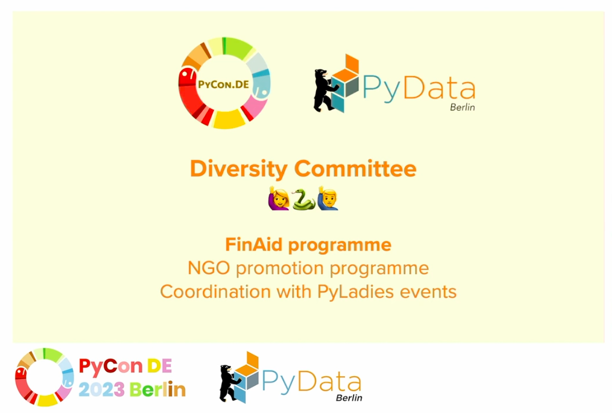
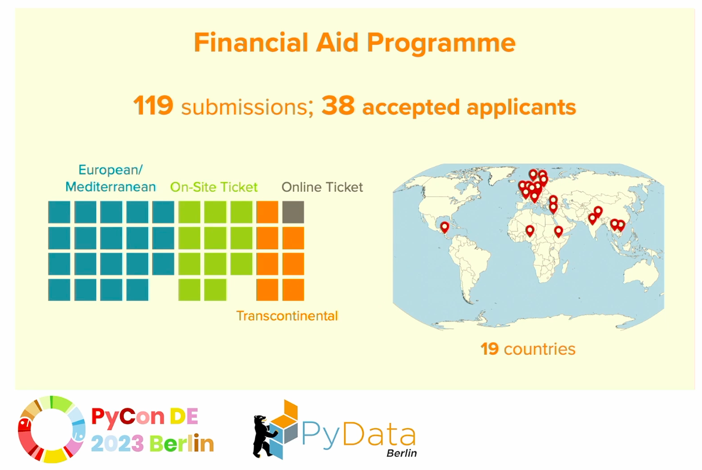
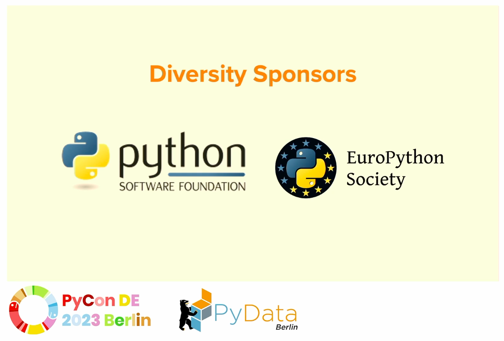
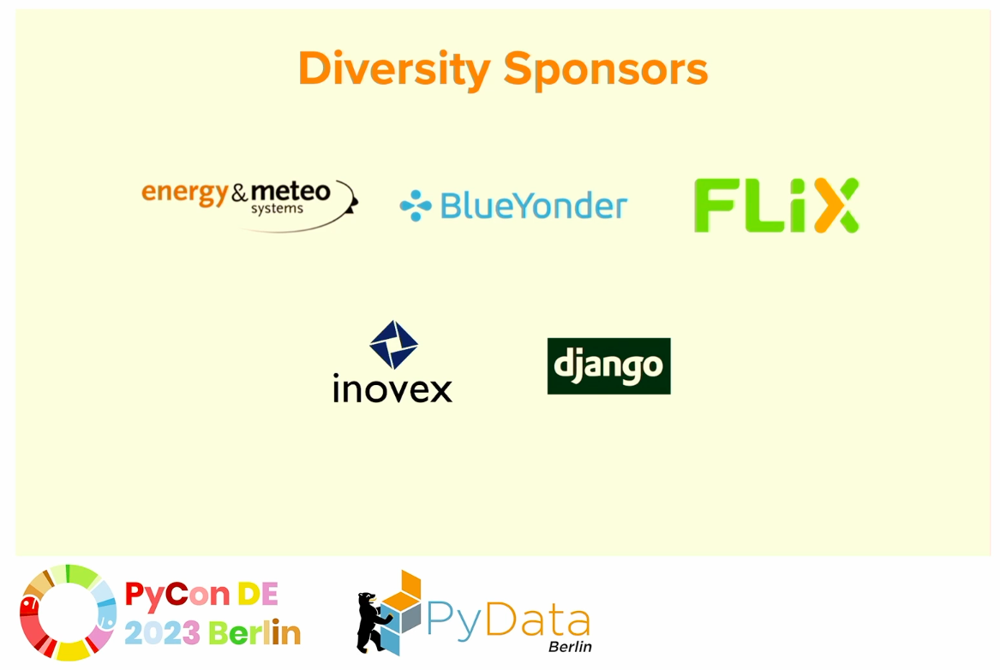

# Topic Modeling of [PyConDe & PyData Berlin 2023](https://2023.pycon.de/) Sessions 








As a first-time attendee of such a great conference, I would say I am so lucky to get the grant provided by the Diversity Committee. It made it possible for me to attend this event and gain valuable insights into the latest trends and innovations in the field and make connection to over 1200 people with same interets. That's amazing!

After back from the event, I think why not using the new things you learned from the conference to make a summary of it. I am going to use spaCy to do topic modelling for all the sessions in PyConDe & PyData Berlin 2023.


### Analysis process and Algorithm

Topic modeling is an unsupervised machine learning technique that extract hidden topics from text. The algorithm I am going to use is LDA.

#### Preparation

The pakages I need:
```
!pip install pyLDAvis -qq
!pip install -qq -U gensim
!pip install spacy -qq
!pip install matplotlib -qq
!pip install seaborn -qq
!python -m spacy download en_core_web_md -qq
```

#### Step 1 get the data - done

#### Step 2 tokenization 

#### Step 3

#### Step 4 Candidate topics

#### Step 5 Topic distribution

### Links
[1] [Github Full Notebook](pyconde_analysis.ipynb)

[2] [spaCy](https://spacy.io/)

[3] [Prodigy](https://prodi.gy/)

### References
[1] [Topic Modelling in Python with spaCy and Gensim](https://towardsdatascience.com/topic-modelling-in-python-with-spacy-and-gensim-dc8f7748bdbf)

[2] [Topic modelling with spaCy and scikit-learn](https://www.kaggle.com/code/thebrownviking20/topic-modelling-with-spacy-and-scikit-learn)

[3] [You are what you read: Building a personal internet front-page with spaCy and Prodigy](https://2023.pycon.de/program/NWSLUH/)
