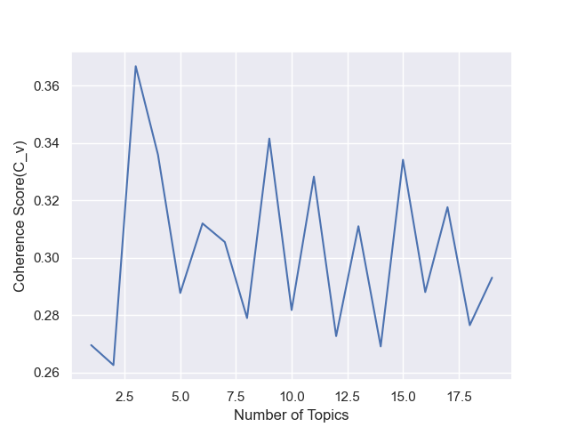
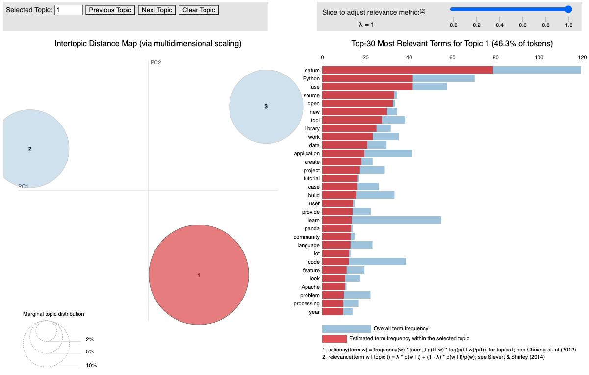
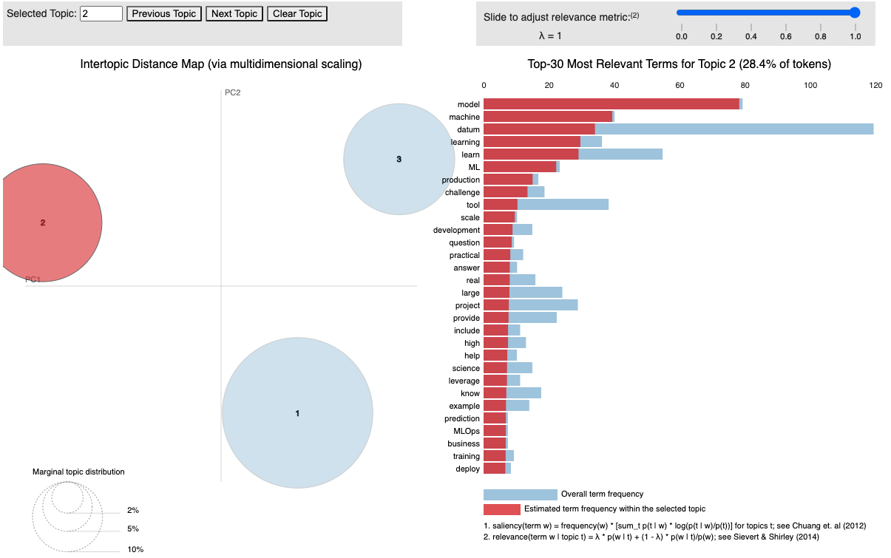
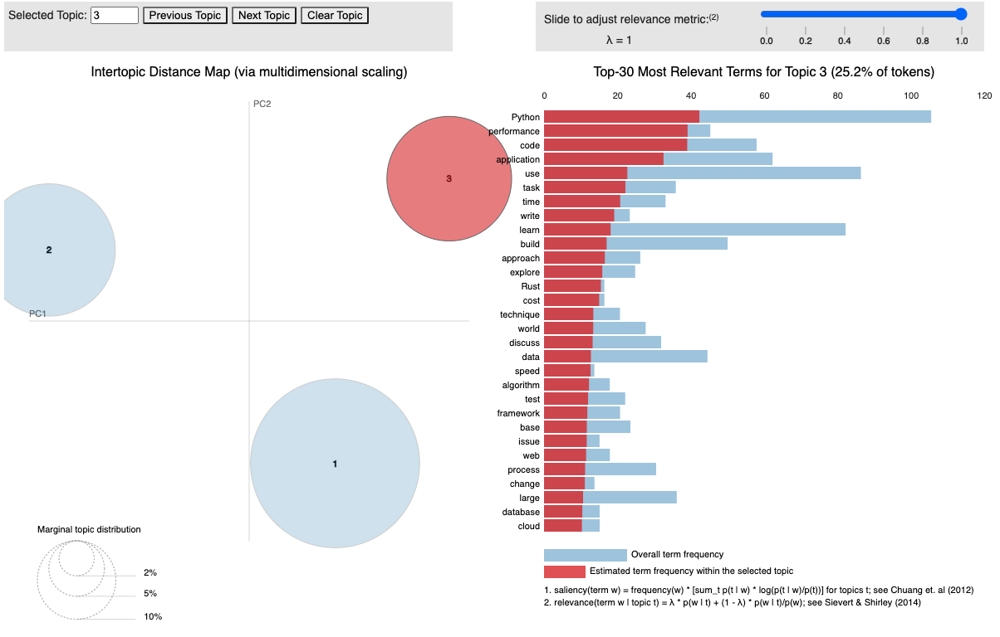

# Topic Modeling of [PyConDe & PyData Berlin 2023](https://2023.pycon.de/) Sessions 

As a first-time attendee of such a great conference, I would say I am so lucky to get the grant provided by the Diversity Committee. It made it possible for me to attend this event and gain valuable insights into the latest trends and innovations in the field and make connection to over 1200 people with same interets. That's amazing!

<div align = "center">


</div>
<div align = "center">


</div>  
<br>

After back from the event, I think why not using the new things I have learned from the conference to make a summary of it. Then I decide to use open source software library [spaCy](https://spacy.io/) to do topic modeling for all the sessions in PyConDe & PyData Berlin 2023. Actually every seesion already has manually assigned track('topic') to it. So what is the differece of the manual assigned track and topic assigned using topic modeling algorithm. I will do a small project on it to figure it out.

<!-- ### Algorithm

Topic modeling is an unsupervised machine learning technique that extract hidden topics from text. The algorithm I am going to use is LDA. -->

### Step 0 Get the Data

I got the session json data from the PyConDe & PyData Berlin 2023 website. And then I preprocess the data from json to pandas DataFrame, and filter the attributes I am interested in, e.g. title, track and abstract etc.. 

There are total 115 sessions, totally 22 tracks and their distribution are shown as following.
```
PyData: Natural Language Processing                                15
PyCon: Programming & Software Engineering                          15
Sponsor                                                            12
PyData: PyData & Scientific Libraries Stack                        10
PyData: Machine Learning & Stats                                   10
PyData: Data Handling                                               9
PyCon: DevOps & MLOps                                               8
PyCon: Python Language                                              4
Plenary                                                             4
PyData: Deep Learning                                               4
General: Ethics & Privacy                                           3
PyCon: Libraries                                                    3
PyData: Jupyter                                                     3
PyCon: Testing                                                      3
General: Others                                                     2
General: Python & PyData Friends                                    2
PyData: Computer Vision                                             2
General: Community, Diversity, Career, Life and everything else     2
PyData: Visualisation                                               1
PyCon: Django                                                       1
PyCon: Web                                                          1
General: Infrastructure - Hardware & Cloud                          1
```

### Step 1 Data Analysis

I will start the process by breaking down the session abstracts into tokens. From the tokens, I will build a dictionary that gives each token a unique ID, which then be used to create the Bag of Words representing the frequency of the tokens. The dictionary and the BoW are used as the inputs of the spaCy pipeline to build a range of topics. The last step is to find the distribution of topics of each session. Here is the [Github full notebook](pyconde_analysis.ipynb).

### Step 2 Results and Discussion

<div align = "center">

</div>

According to the coherence score, the topic number 3 has the max value. I choose go with 3 topics. Then print out the 3 topics and the related words:

```
[(0, '0.046*"model" + 0.035*"datum" + 0.020*"learn" + 0.018*"learning" + 0.018*"machine" + 0.016*"source" + 0.015*"Python" + 0.014*"performance" + 0.014*"open" + 0.013*"time"'),
 (1, '0.036*"machine" + 0.036*"model" + 0.034*"panda" + 0.028*"learning" + 0.024*"new" + 0.022*"change" + 0.020*"discuss" + 0.018*"Python" + 0.017*"community" + 0.016*"work"'),
 (2, '0.048*"datum" + 0.032*"Python" + 0.030*"use" + 0.023*"application" + 0.022*"code" + 0.021*"work" + 0.018*"data" + 0.018*"tool" + 0.016*"learn" + 0.013*"project"')]
```
Next visulize the topics and the words in each topics. It shows word frequency (blue) and estimated term frequency within the selected topic (red).
<div align = "center">



</div>

<!-- [3] [Prodigy](https://prodi.gy/)

### References
[1] [Topic Modelling in Python with spaCy and Gensim](https://towardsdatascience.com/topic-modelling-in-python-with-spacy-and-gensim-dc8f7748bdbf)

[2] [Topic modelling with spaCy and scikit-learn](https://www.kaggle.com/code/thebrownviking20/topic-modelling-with-spacy-and-scikit-learn)

[3] [You are what you read: Building a personal internet front-page with spaCy and Prodigy](https://2023.pycon.de/program/NWSLUH/)  -->
